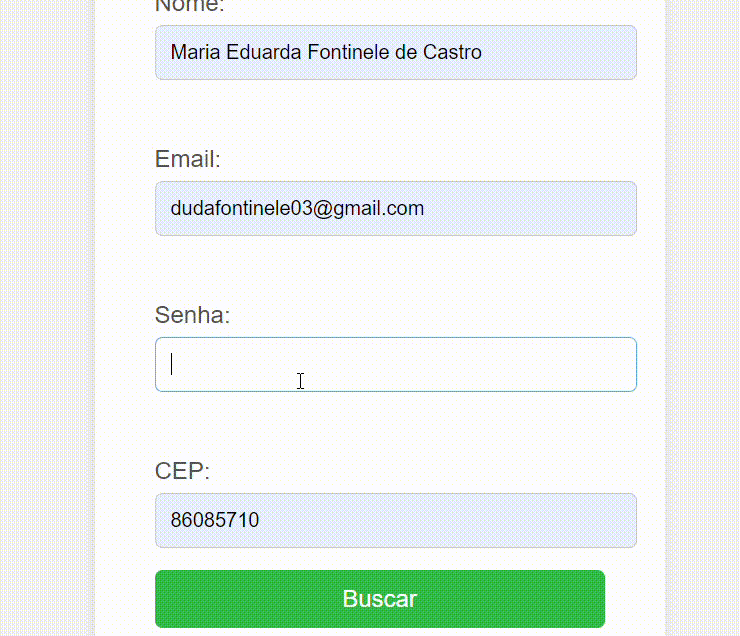

#  Formulário de cadastro [COMPLETO]
 
# `ÍNDICE`
 
* [Introdução](#introdução)
* [Descrição](#descrição)
* [Funcionalidades](#funcionalidades)
* [Tecnologias utilizadas](#tecnologias-utilizadas)
* [Autores](#autores)
* [Resultado](#resultado)
 
## `Introdução`
O formulário de cadastro apresentado aqui é uma ferramenta essencial para plataformas de e-Commerce e serviços online. Ele permite que novos usuários criem uma conta de maneira fácil e segura. Com campos para informações pessoais, como nome, email, CPF e data de nascimento, o formulário garante que todos os dados necessários sejam coletados para um cadastro completo.
 
 
## `Descrição`
Este formulário de cadastro foi projetado para facilitar a criação de contas em plataformas de e-Commerce e serviços online. Com um layout intuitivo e responsivo, ele permite que os usuários insiram suas informações pessoais de maneira rápida e organizada.
 
 
## `Funcionalidades`
Coleta de Informações Pessoais:
O formulário permite que o usuário insira dados essenciais como nome, email, senha, CPF, data de nascimento, e endereço completo.
 
Validação de Campos:
Email: Verificação automáticamente o formato correto do email.
CPF: Validação para garantir que o CPF inserido é válido

 ``Só ocorre se todos os campos necessários estiverem preenchidos corretamente.``
 
 
 ## `Tecnologias utilizadas`
 HTML
 CSS
 Javascrip
 API
 
 ## `Autores`
Maria Eduarda Fontinele

 ## `Resultado`

 
 